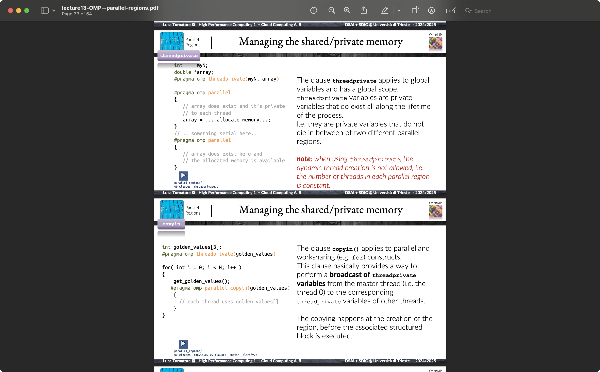

# Notes

The images serve as map, first of all this is the initial steps you have to take:

## Additional Info

- Lecture 6 deals with concept regarding good code (check to be sure your code is good)

## Broadcasting OpenMP

Remember how to broadcast something

> [!IMPORTANT]
> In general It is advised to know how to reimplement all of those features
